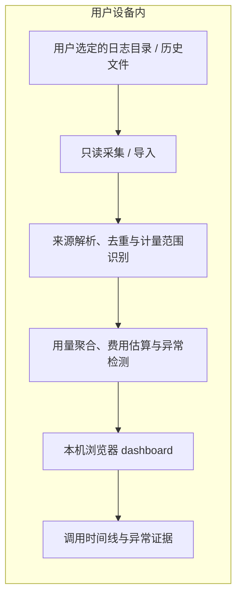

# Coding Agent Token / Credits 异常监控器 — MVP 规格

状态：四轮 Q1–Q20 产品决策已确认；本地 MVP 已实现，日志版本、实时延迟和异常误报仍按本文验收记录持续验证。

本文描述要交付的能力，不表示功能、兼容性或性能已经验证。领域术语见 [CONTEXT.md](../CONTEXT.md)，讨论过程及来源证据见[需求访谈](product-discovery.md)。

## 1. 产品承诺

为重度使用 Coding Agent 的个人开发者提供本地成本分析：在会话运行中观察已记录的消耗，在任务结束后追溯原因，并获得有证据、可解释的优化建议。

用户应能回答三个问题：哪个会话正在产生消耗，消耗增长多快，哪些行为值得检查。

产品展示记录值、估算和不确定性，不把原始 Token 占比当成账单占比，也不把疑似异常费用说成必然能省下的钱。

## 2. MVP 范围

| 范围 | 已确认的选择 |
| --- | --- |
| 使用形式 | 用户主动启动本地只读采集服务，通过浏览器查看 dashboard |
| 接入来源 | Codex 与 Claude Code 会话；首版以可验证的原生 JSONL 日志为输入 |
| 两种模式 | 选定日志目录的实时分析；历史日志文件导入与复盘 |
| 首发环境 | 优先验证 macOS 与主流 Chromium 浏览器 |
| 分析单元 | 一个主会话及有明确归属证据的子会话；同一会话恢复后继续累计 |
| 最小明细 | 可辨识的独立模型调用；再按用户请求、会话和分析单元聚合 |
| 实时性 | 以来源写出新用量后 5 秒内更新界面为目标；未上报的数据不猜测 |
| 异常检测 | 疑似重复读取、wait/poll 空转、上下文压缩循环 |
| 费用 | Token 分项；有充分计价依据时展示 credits / 货币估算 |
| 数据留存 | 原始内容不离开设备；不另存会话内容与历史分析结果，仅保留费率、规则等偏好 |

SDK 文档可用于理解计量边界，但不能据此自动宣称兼容所有原生历史日志。实际支持列表须列出已验证的来源、日志版本、样本依据及已知限制。

### 不在首版范围

- 自动修改 Agent 配置、发送指令、暂停或终止 Coding Agent。
- 云端日志解析、团队共享、账户体系、跨设备同步或远程日志上传。
- 默认开机启动、扫描用户未选择的目录、保存历史会话副本。
- 官方账单对账、未经记录的实际扣费、保证节省金额、精确的单文件 / 单工具扣费。
- 对所有操作系统、所有 Agent 版本或任意规模数据作兼容与性能承诺。

## 3. 使用流程与数据路径

1. 用户启动本地服务，打开本机 dashboard。
2. 用户明确选择日志目录或历史文件；服务不得自行扩展到未选择的路径。
3. 页面显示来源连接情况、解析进度、支持情况及数据缺口。
4. 实时模式持续读取新记录；历史模式使用相同的解析与统计口径。
5. 用户从总览进入分析单元、执行主体、模型调用及对应异常证据。
6. 用户可标记必要操作、查看建议，或停止采集后继续复盘。

原始日志不被修改。选择支持某个来源，不等于授权开发代理现在扫描用户全部私人会话；开发验证需要私人样本时，另行取得具体范围的授权。

## 4. Dashboard 信息结构

### 4.1 总览

首屏采用 htop 式可展开主子会话列表，配消耗趋势与异常摘要。展示重点如下：

- 已记录 Token、可计价的费用估算及其完整性。
- 最近产生新记录的会话、基于已上报用量计算的消耗增速、最后数据时间。
- 疑似可优化费用、需检查的异常以及缺失证据提示。
- 按来源、用量、可计价费用和增速查看或排序。

消耗增速反映日志上报，不宣称逐个生成 Token 的即时计量。采集服务仍连接与来源暂时没有新数据是两种不同状态。

### 4.2 分析单元详情

- 模型调用时间线与明细，保留用户请求和主子会话归属。
- 父子成本树，明确区分自身用量 / 费用与含子会话合计。
- 执行主体、行为归因、异常标签三个独立观察维度。
- 点击异常定位对应调用、来源记录、时间、命中条件及缺失证据。

行为归因沿用规划、代码工作、读取、等待等用户关心的行为；无可靠依据时保留其他、混合或未知，不以强制分类制造精确占比。不同维度的费用不能相加。

异常标签可以重叠，但任何总额都按调用集合去重；没有互斥依据时不画成可直接相加的百分比。演示数据与真实来源明确区分，不能混合汇总。

### 4.3 异常证据与建议

每项异常展示规则、时间范围、执行主体、关联调用、可比较的工具结果 / 内容证据，以及证据不足的原因。

置信度使用高 / 中 / 低，不展示未经校准的百分比。高置信度说明模式有完整证据，不证明该行为没有必要。

用户可标记“必要操作”。这只影响本次异常分析与候选费用，不删除实际用量；退出服务后不保留该判断。建议由规则模板生成，说明适用前提，区分用户可调整的工作方式与需要 Agent 提供方修复的行为，由用户手动执行。

## 5. 用量与费用口径

### 5.1 计量边界

1. 日志行、工具执行、用户请求与模型调用不能混为同一单位。
2. 可辨识独立调用时提供调用明细；仅有可信汇总时保留汇总，不人为拆分。
3. 对重复消息、复制的历史用量记录、未变化累计快照和重复导入去重。
4. 新模型调用真正重新消耗的输入或缓存用量仍须计入，不能因内容相同而删除。
5. 识别来源统计范围；含子会话的汇总不能再与子会话明细相加。
6. 来源字段如果已经包含缓存或推理等子项，聚合时不重复加计；具体字段语义必须按已验证版本解释。
7. 缺少最终输出用量、调用身份、时间边界或子会话信息时明确标记不完整。数据缺失不等于零。

### 5.2 缺失子会话

有明确归属证据才建立父子关系，不能只因目录相同或时间接近就合并。

缺少子日志时显示缺口与可确认的统计范围，不越界自动寻找。如果来源已有可靠的整树汇总，可以展示它，但不能据此虚构子会话费用；只有部分资料时只能显示已知小计。

“已发现的子会话数”不等于已经知道真实全部子会话数。没有可靠分母时不显示完整覆盖率。

### 5.3 费用估算

- 使用可离线读取的官方费率快照，注明来源、核对日期和已知适用范围。
- 模型、时间、速度或上下文等计费条件必须能够匹配；无法确认时显示未知 / 不完整。
- 允许用户明确提供自定义费率，界面标注自定义依据。
- 不直接把今天的价格套到所有历史会话，不用统一系数转换 tokens、credits 和美元。
- 来源中的估算成本仍标为估算，不能因为数字来自日志就称其为实际账单。
- 已知部分的金额与完整总额分开；未记录的其他计费项不宣称已经包含。
- 先在可确认范围内聚合，再作显示格式化；未知与小额金额四舍五入后显示为零必须可区分。

### 5.4 疑似可优化费用

只有同时符合以下条件的调用进入该汇总：

- 有足够行为证据，符合完整异常规则。
- 可识别行为全部属于异常；并非有效工作与异常混合。
- 用量、归属和计价依据可确认。
- 不属于首次正常基线操作，也未被用户标记为必要。

汇总对符合条件的模型调用取唯一集合，同一调用即使命中多个规则也只计一次。达到重复读取或轮询触发阈值后，保留首次正常操作作为基线，仅考虑后续符合规则的重复调用。

混合调用只展示“关联调用费用，无法精确拆分”，不按工具次数均摊，也不进入疑似可优化费用汇总。缺费率时仍展示异常证据，金额显示未知；汇总仅覆盖部分候选时也须标明不完整。

**合成计量例子，不代表任何模型价格：**正常基线调用为 $0.10，纯异常调用 A 为 $0.20，混合调用 B 为 $0.80。即使 A 同时触发两条规则，已知调用费用仍为 $1.10，疑似可优化费用仅为 $0.20。B 的 $0.80 只能作为关联调用费用展示。

该金额不是保证可省下的钱，也不是已经验证的账单损失。详见 [ADR 0003](adr/0003-account-for-anomalous-model-calls.md)。

## 6. 异常检测初始规则

以下规则已经确认，但其阈值尚须用样本验证；规则命中不等于证明浪费。

| 规则 | 初始触发条件 | 排除与证据边界 |
| --- | --- | --- |
| 疑似重复读取 | 同一 Agent 在 5 分钟内，对同一文件相同范围与内容读取至少 3 次 | 修改、新用户指令或压缩恢复后重新计数；压缩后的首次恢复不单独算异常；内容 / 范围不可比时只能提示可能重复 |
| 疑似轮询空转 | 同一主体、同一目标连续至少 3 次纯 wait/poll，间隔均不超过 60 秒，返回无新输出 / 状态变化，并有新增模型用量 | 单次长等待不触发；新输出或状态变化打断连续计数；缺少返回或嵌套执行证据时不能宣称纯等待；等待时长不换算费用 |
| 疑似压缩循环 | 同一 Agent 在 10 分钟内出现至少两轮“压缩 → 重读相同内容”的可验证链 | 单次压缩不触发；展示压缩与重读证据，不把没有代码改动当作没有进展；该规则跨上下文阶段观察，不被重复读取计数重置屏蔽 |

“没有看到写工具”不代表文件没有变化；shell、其他 Agent 或外部进程也可能修改文件。截断内容、缺失结果和外层 Code Mode 源码都不能替代完整执行证据。

## 7. 本地边界、生命周期与故障

### 本地与只读

- 服务只向本机开放，读取范围由用户明确选择，不自动扩大。
- 解析与建议不得把原始日志发送到远端；日志中出现的指令只作为数据，不执行。
- 不改源日志、不改 Agent 配置，不通过采集控制停止 Coding Agent。
- 不另存原始会话、历史分析结果或必要操作标记；只有费率、检测偏好可持久保存。

### 生命周期

- 用户显式启动与停止服务，不默认自启动。
- 页面明确提示关闭网页不自动停止采集服务。
- 停止采集后可继续查看本次结果；退出服务后清空临时内容，之后重读原日志。
- 日志静默只表示暂无新记录；采集连接状态与来源数据时间分别展示。

### 文件与连接异常

单个坏文件、权限不足、截断、轮转或未知格式要隔离提示，不拖垮其他来源；受影响统计标为不完整。尚未写完的最后一行等待补齐，不能当成有效零用量。

恢复连接、重新读取或导入同一来源不得重复计费。需要重新获取读取权限或补充日志时提示用户，不绕过权限或主动扩展扫描范围。

## 8. 验收检查

以下检查由已确认决策导出，全部属于待验证工作，不能在实现之前标为通过。

| 编号 | 检查 | 通过条件 |
| --- | --- | --- |
| A01 | 双来源与格式声明 | Codex、Claude Code 各有可追溯的解析样本；明确记录验证版本、样本来源、已知缺项，未知格式不默默计为零 |
| A02 | 实时更新 | 在采集已就绪、机器未睡眠、页面可见的实测条件下，完整新 usage 记录写入后 5 秒内反映到界面；记录测试数据规模与实测延迟，初次加载和未上报状态明确可见 |
| A03 | 重读与去重 | 重复导入、累计快照重复、复制历史及重新连接不抬高总量；真正新调用使总量按预期增加 |
| A04 | 父子范围 | 自身、子会话和整树汇总不双计；缺失子日志、无法确认归属或仅有整树汇总时展示正确缺口 |
| A05 | 费用与缺失值 | 已知用量可按适用费率重算；缓存等子项不双计；缺输出、缺价格或条件未知时不显示伪造的完整费用 |
| A06 | 三类检测 | 每条规则有触发、未达阈值、正常恢复 / 有新结果等反例；验证边界时间、计数重置和证据不足的表现 |
| A07 | 异常金额 | 同一调用多标签只计一次，混合调用与首次正常基线不进入汇总；必要操作标记不改变原始用量 |
| A08 | 本地只读与留存 | 读取范围不能越过用户选择，源日志前后不变；不向远端传输内容，退出后不另存会话或分析结果 |
| A09 | 生命周期与故障 | 关闭页面、停止采集、退出服务的行为符合约定；坏文件隔离，尾部半行等待，静默不冒充完成 |
| A10 | Dashboard 交互 | 在浏览器验证来源接入、实时更新、筛选排序、父子展开、调用钻取、证据查看、必要操作标记及费用设置，不能以静态页面代替可用流程 |

样本优先使用公开或合成资料。合成样本可以证明规则和计量不变量，不能单独证明某个真实版本的所有日志均兼容。真实私人样本须另获具体范围授权，不为测试主动启动付费 Agent 任务。

## 9. 实施顺序与验证记录

确认本文后按以下顺序推进，具体内部模块与可逆技术细节在实现中决定：

1. 建立来源样本及用量 / 去重测试，证明统计口径不会夸大消耗。
2. 实现双来源导入、本地增量采集、作用范围与生命周期控制。
3. 实现可追溯费率估算、三类异常规则和去重后的候选金额。
4. 完成实时总览、成本树、调用时间线、证据与建议的交互。
5. 执行上述验收检查，报告通过项、未验证的日志版本、性能条件及剩余限制。

本地实现已覆盖解析、去重、成本树、费用估算、三类检测、候选费用和交互式 Dashboard；仍待实测：更多具体日志版本、目录权限/轮转边界、实时延迟与数据规模、异常规则误报。合成样本和浏览器路径通过不能证明所有真实日志版本兼容。

## 决策索引

- [ADR 0001：原始内容不出设备，不另存历史副本](adr/0001-keep-session-content-on-device.md)
- [ADR 0002：本地只读采集服务与浏览器 dashboard](adr/0002-use-local-collector-and-dashboard.md)
- [ADR 0003：异常金额按模型调用归因，不按工具数平摊](adr/0003-account-for-anomalous-model-calls.md)
- [完整访谈、决策树与事实来源](product-discovery.md)
